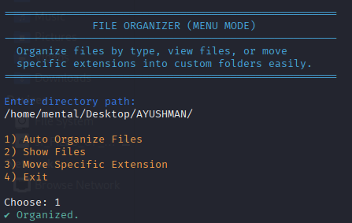

# File Organizer (Bash Menu Script)

A simple and clean **menu-based file organizer** script for Linux.  
It helps you **automatically sort files** in a directory based on their **file types**,  
view current files, or move only selected file extensions into custom folders.

---

## 📸 Preview


---

## ✅ Features
- Automatically organizes files into categorized folders:
  - Images
  - Documents
  - Text files
  - Videos
  - Music
  - Others (for unknown file types)
- Shows all files in the selected directory
- Move only a **specific extension** into a folder of your choice
- **Colorful & easy menu UI**

---

## 🧾 Menu Options

| Option | Action |
|-------|--------|
| **1** | Auto organize all files by type |
| **2** | Show current files in folder |
| **3** | Move specific file extension to custom folder |
| **4** | Exit program |

---

## 🚀 Usage Instructions

### 1. Make the script executable:
```bash
chmod +x organize_menu.sh
2. Run the script:
bash
Copy code
./organize_menu.sh
3. Enter the directory path:
Example:

arduino
Copy code
/home/user/Downloads
🗂 Example Output
Before:

Copy code
photo.jpg
notes.txt
song.mp3
report.docx
movie.mp4
After running Auto Organize:

bash
Copy code
Images/photo.jpg
TextFiles/notes.txt
Music/song.mp3
Documents/report.docx
Videos/movie.mp4
🛠 Requirements
Linux

Bash shell

💡 Notes
This script only organizes files, not folders.

If a file extension does not match any known type, it goes into Others/ automatically
